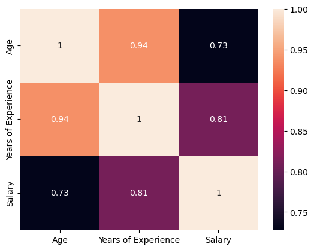
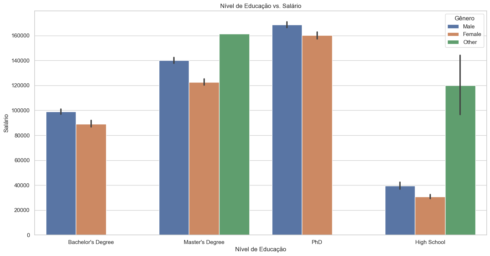
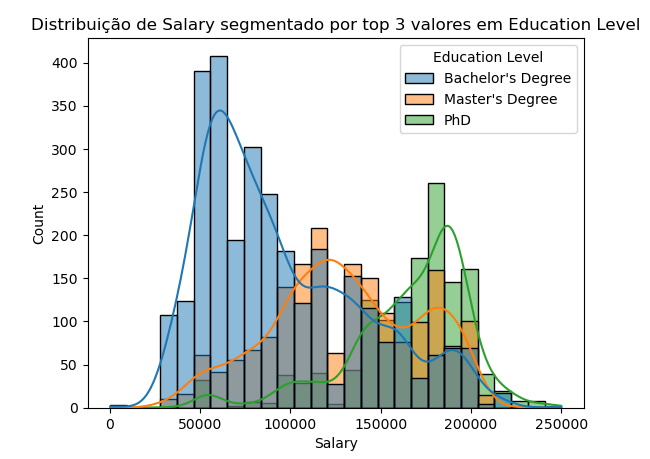
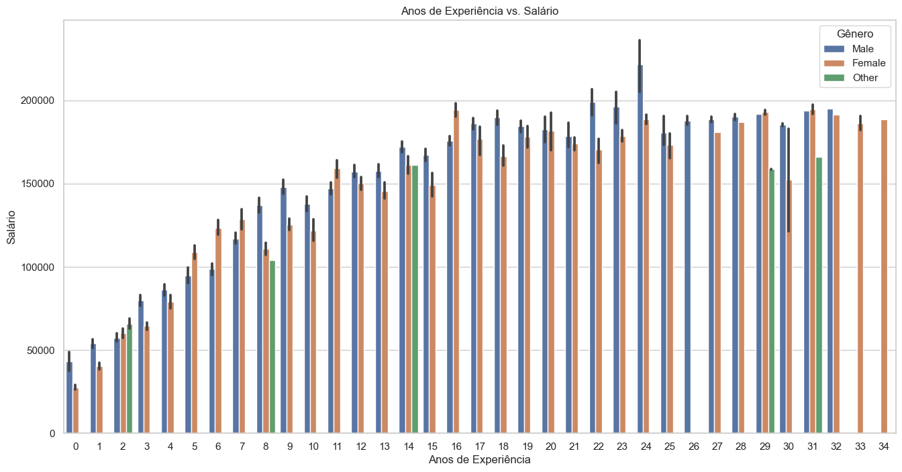
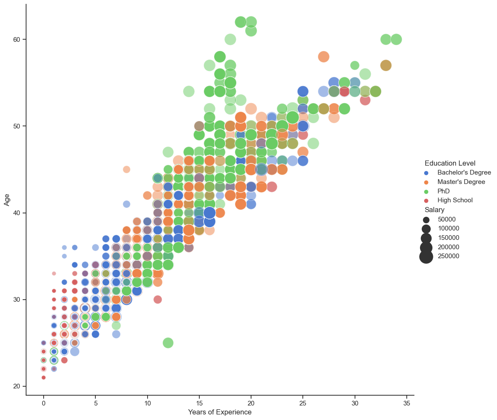
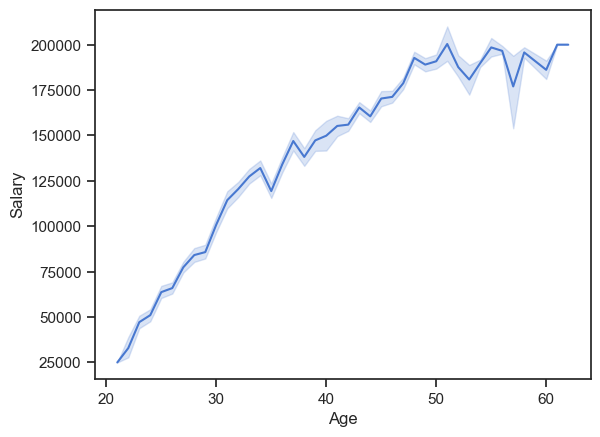
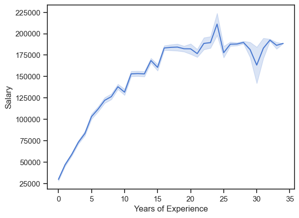
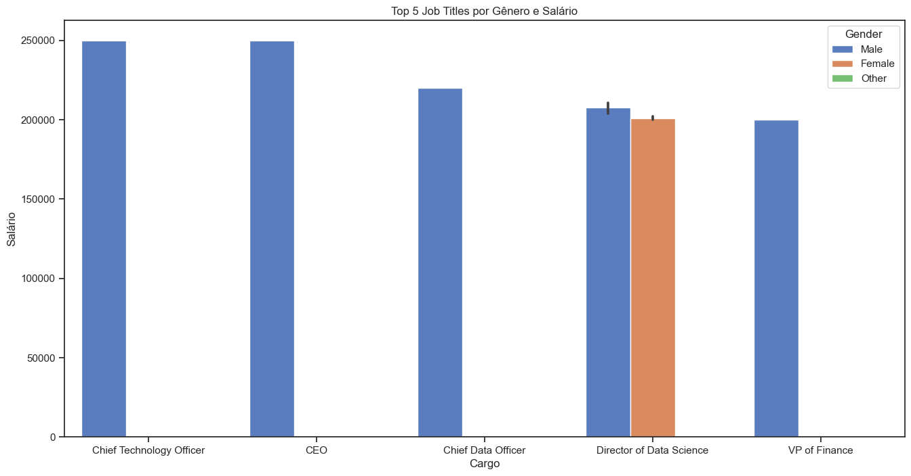
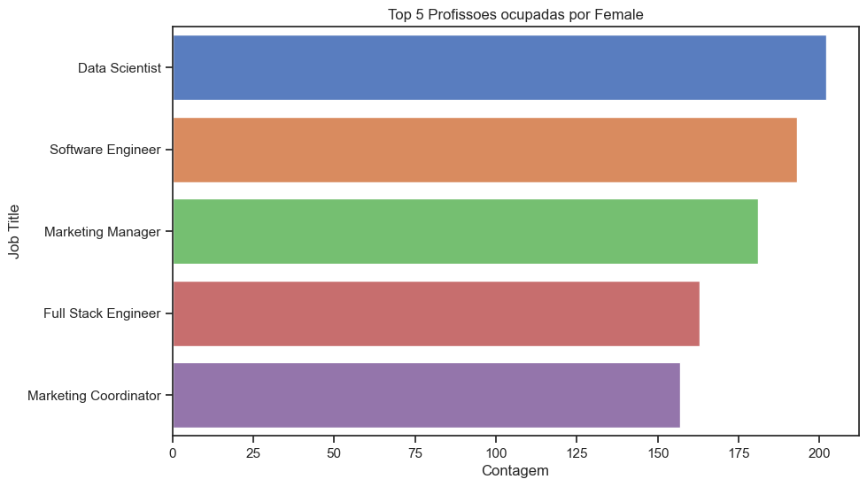
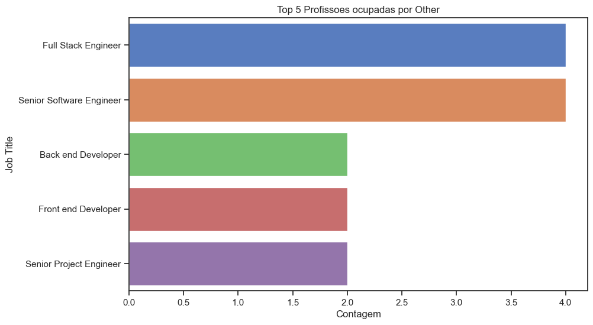

# Análise Estatística de Dados 

Código desenvolvido para tratamento, limpeza, processamento, preparo, análise estatística e visualização de dados com a base de dados [Salary](https://www.kaggle.com/datasets/mohithsairamreddy/salary-data/data) disponível no Kaggle.  

O projeto visou cumprir os requisitos de **Estatística**, do bootcamp de Dados da **Ada Tech**, patrocinado pelo **Potência Tech**, do **iFood**. 

O projeto foi realizado em março de 2024 e contou com a colaboração de 2 integrantes:
* Pedro Lustosa
* Rafael Guisso

# Análise Geral

## Tendências Gerais encontradas

**1. Correlação forte e possitiva:**

**2. Homens ganham mais que as mulheres em qualquer nível de educação:**

+ É possível notar também que um maior nível educacional costuma resultar um maior salário:

**3. O mesmo vale para anos de experiência:**

+ Com relação aos anos de experiência, os homens em geral ganham mais, mas a tendência é igualar ou até diminuir com relação aos salarios das mulheres.

**4. Idades mais avançadas há um aumento na quantidade de anos de experiência e do nível de educação:**

**5. Homens ocupam cargos com melhores salários:**

**6. Sem tendência com relação a quantidade de ocupação por cargo:**

 

# Ferramentas utilizadas

| Python | Numpy | Pandas | Seaborn | Matplotlib | Git | 
| ------ | ----- | ------ | ------- | ---------- | --- | 
|  |  |  | |  |  |

# Como rodar

> Clique [GitHub](https://github.com/pedrolustosab/Analise_Explorataria_Salarios).

